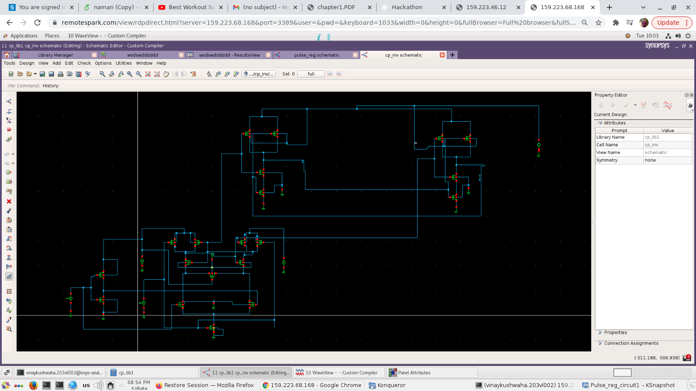
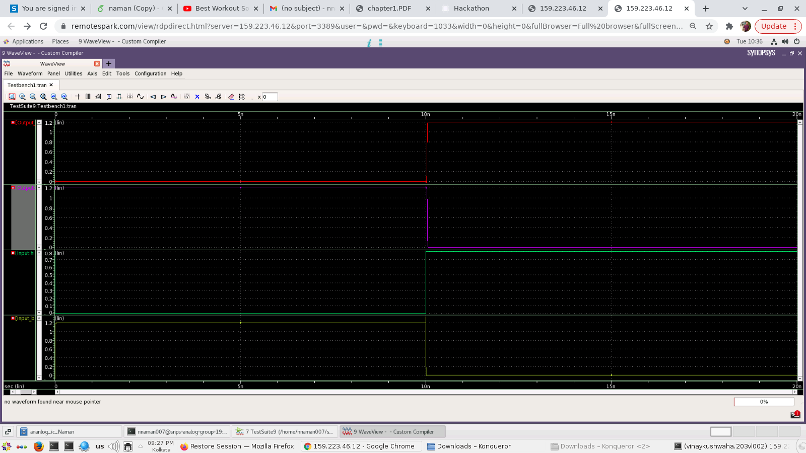

# Analog_Design_Hackathon

# Sense Amplifier Circuit

image

## Introduction

Instead of pulse based flip flops sense amplifier based flip
flop can be used.They accept small inputs and amplifies them
to rail to rail swing. .Sense amplifier samples the input ’IN’
on the rising edge of the clock.The output is fed to SR latch.
This structure guarantees only one switch at output in a clock

## Output

image

