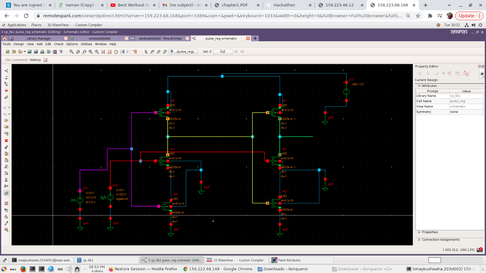
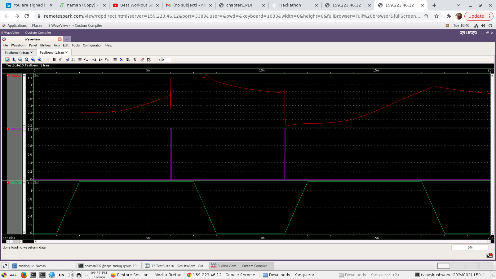

# Analog_Design_Hackathon

# Sense Amplifier Circuit

## Introduction

Instead of pulse based flip flops sense amplifier based flip
flop can be used.They accept small inputs and amplifies them
to rail to rail swing. .Sense amplifier samples the input ’IN’
on the rising edge of the clock.The output is fed to SR latch.
This structure guarantees only one switch at output in a clock

## Output

# Analog_Design_Hackathon

# Pulse Register

## Introduction

Conventional D flip flop samples data on clock
low edge and data is hold when clock becomes high.It also
requires both clock and clock bar signals which require extra
circuit for clock bar generation. Overlap of clock and clock
bar causes glitches.To avoid this pulsed latch can be used. Conventional D flip flop
Pulse based flip flop generates a short pulse around positive
or negative edge of clock.This pulse enables latch for short
duration.In this duration data is stored into the latch.Advantage of this approach
is reduced clock load and small number of transistors.
Disadvantage is increase in design verification complexity.

## Output

